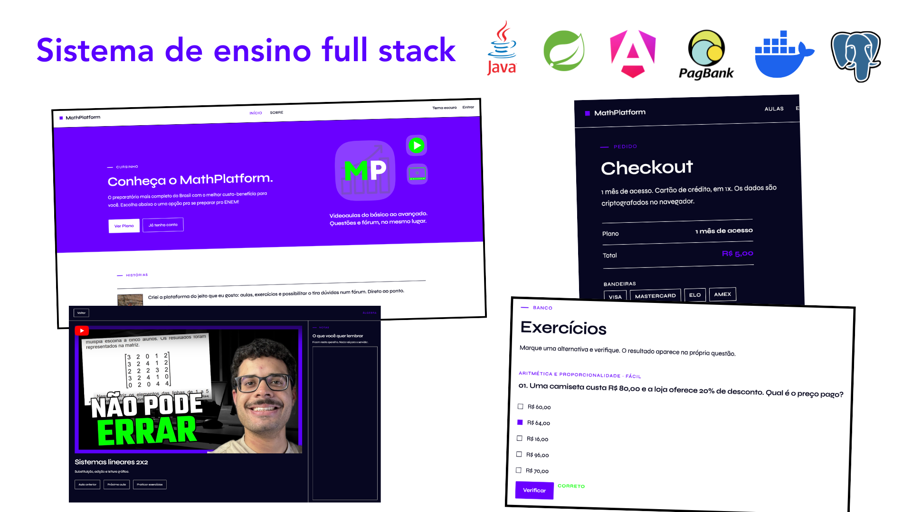
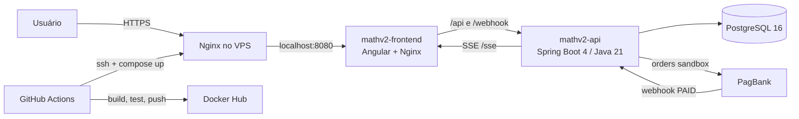
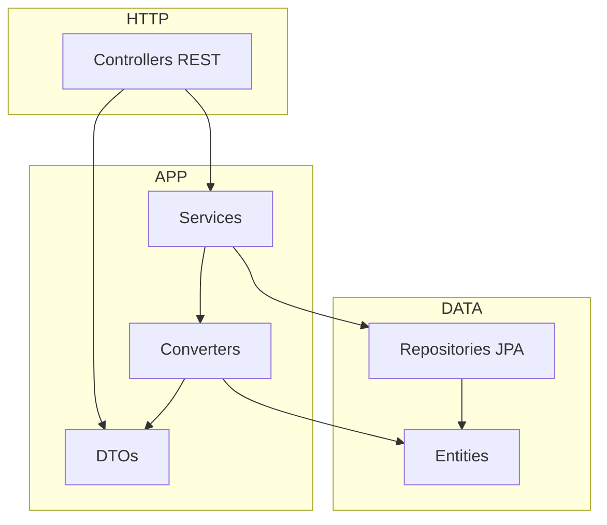
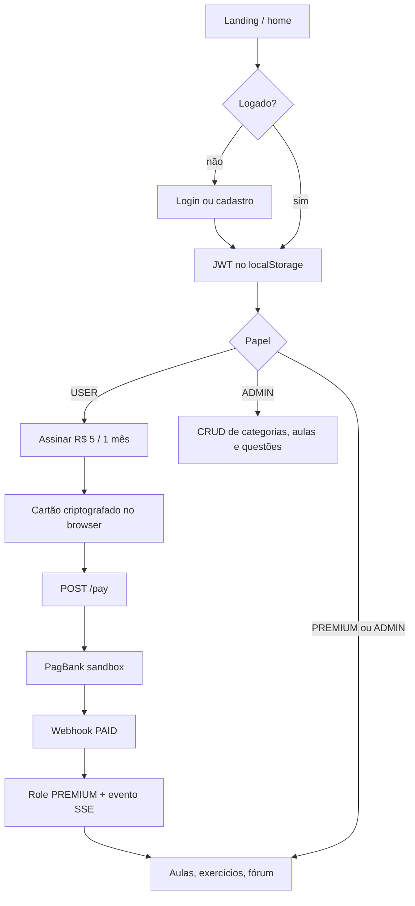
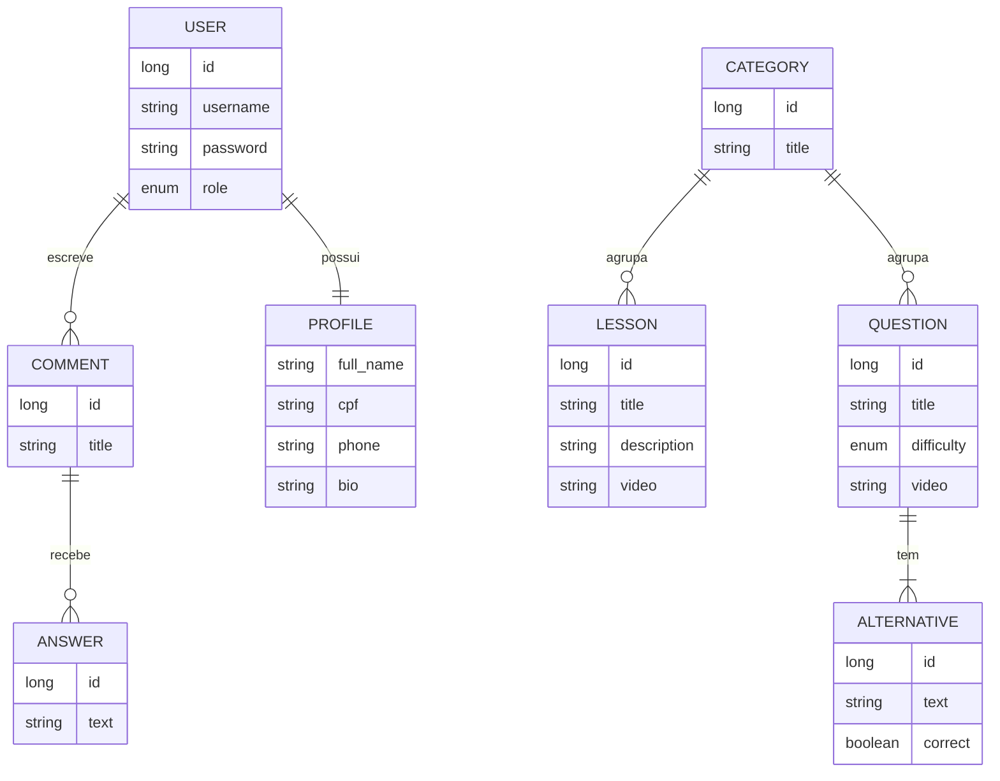
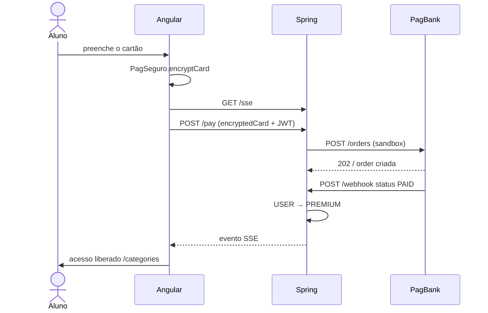
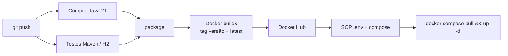

# MathPlatform

**Plataforma educacional full stack** para estudo de Matemática (ENEM): videoaulas, questões comentadas e fórum de dúvidas com autenticação JWT, user roles, pagamento real (PagBank) e deploy automatizado.

[](https://math.cesarburil.com.br)
[](https://openjdk.org/)
[](https://spring.io/projects/spring-boot)
[](https://angular.dev/)
[](https://www.postgresql.org/)
[](https://www.docker.com/)
[](.github/workflows)

> Projeto de portfólio de [Cesar Buril](https://github.com/cesarburil), Engenheiro de Computação.  
> **Publicado (utilize agora mesmo):** [math.cesarburil.com.br](https://math.cesarburil.com.br) · conta de exemplo: `demo` / `demo`



## Arquitetura

Três containers no mesmo Docker Compose. O Nginx do **host** termina HTTPS e encaminha para o frontend; o Nginx **dentro** da imagem Angular serve a SPA e faz proxy de `/api` e `/webhook` para o Spring.



### Backend (camadas)



---

## O que o aluno (e o admin) fazem



---

## Funcionalidades

**Estudo**
- Catálogo por tema (aritmética, álgebra, funções, geometria, trigonometria, combinatória, probabilidade, estatística, matemática financeira)
- Videoaulas com player do YouTube
- Questões de múltipla escolha (5 alternativas, 1 correta), dificuldade e correção no servidor
- Fórum: tópicos e respostas vinculados ao usuário autenticado

**Conta e acesso**
- Cadastro e login com JWT (claim `role`)
- Três roles: `USER`, `PREMIUM`, `ADMIN` (admin herda premium)
- Guards de rota no Angular e `@PreAuthorize` no Spring
- Tema claro / escuro

**Pagamento**
- Checkout de cartão com criptografia PagBank no cliente (o backend nunca vê o PAN)
- Pedido na API sandbox, webhook público e atualização para `PREMIUM`
- Confirmação em tempo real via **Server-Sent Events** (`GET /sse`)

**Operação**
- Painel admin para categorias, aulas e questões
- Swagger UI para explorar a API
- Seed do catálogo na subida da aplicação
- Pipeline separado para backend e frontend (compile → testes → imagem → deploy)

---

## Stack

| Camada | Tecnologia |
| --- | --- |
| Frontend | Angular 21 (standalone, signals), TypeScript, Tailwind CSS 4, RxJS |
| Backend | Java 21, Spring Boot 4.1, Spring Security, Spring Data JPA, Validation |
| Auth | JWT (JJWT 0.12), BCrypt, sessão HTTP stateless |
| Banco | PostgreSQL 16 · H2 em testes |
| Pagamento | PagBank / PagSeguro sandbox, OkHttp, webhook, SSE |
| Docs | springdoc-openapi (Swagger UI) |
| Front de borda | Nginx (SPA + reverse proxy) |
| Entrega | Docker multi-stage, Docker Compose, GitHub Actions, Docker Hub, VPS |

---

## Modelo de dados



---

## Pagamento (sequência)

O cartão é criptografado no browser com a chave pública do PagBank. O Spring envia só o payload criptografado, registra o `username` como `reference_id` e promove o usuário quando o webhook chega com `PAID`.



---

## Autenticação e autorização

| Papel | Quem é | O que libera |
| --- | --- | --- |
| `USER` | Cadastro padrão | Conta + checkout |
| `PREMIUM` | Pagamento confirmado | Aulas, exercícios, fórum |
| `ADMIN` | Operação do conteúdo | Tudo do premium + CRUD |

- Filtro JWT antes de `UsernamePasswordAuthenticationFilter`
- Rotas públicas: `/login`, `/register`, `/webhook`, `/sse`, Swagger
- Rotas de escrita de catálogo: `hasRole('ADMIN')`
- Angular: `authguardGuard` (precisa de token) e `payGuard` (bloqueia quem já é premium)
- Interceptor HTTP anexa `Authorization: Bearer …` e limpa a sessão em `401`

Documentação interativa da API: `http://localhost:8080/swagger-ui/index.html` (no container) ou via `/api` no ambiente publicado.

---

## Estrutura do repositório

```
MathPlatform/
├── mathBackend/                 Spring Boot (Java 21)
│   └── src/main/java/.../mathBackend/
│       ├── auth/                login, JWT, UserDetails, SecurityFilterChain
│       ├── admin/               ping de admin
│       ├── category/            CRUD + seeder do catálogo
│       ├── lesson/              videoaulas
│       ├── question/            questões e correção
│       ├── comment/             fórum (Comment + Answer)
│       ├── payment/             PagBank, webhook, SSE
│       ├── profile/             dados do usuário autenticado
│       └── infra/exception/     handler global
├── mathFrontend/                Angular 21
│   └── src/app/
│       ├── components/          home, aulas, questões, fórum, admin, pagamento
│       ├── services/            HTTP + SSE
│       ├── models/              contratos da API
│       └── http/                interceptors (auth + toast de erro)
├── docker/
│   ├── backend/Dockerfile
│   ├── frontend/Dockerfile
│   ├── host-nginx/              HTTPS no VPS
│   └── seed-math-content.sql
├── docker-compose.yml
└── .github/workflows/           pipeline-backend.yml + pipeline-frontend.yml
```

---

## Como rodar localmente

### Requisitos

- JDK 21, Maven Wrapper (`./mvnw`)
- Node 22 + npm
- Docker (PostgreSQL, ou o stack inteiro)

### 1. Banco

Na raiz do repositório, com um `.env` contendo `POSTGRES_USERNAME` e `POSTGRES_PASSWORD`:

```bash
docker compose up -d postgres
```

O Postgres sobe em **`localhost:5433`**, database `mathv2`.

### 2. Backend

```bash
cd mathBackend
cp src/main/resources/application.properties.example \
   src/main/resources/application.properties
```

Exporte as variáveis (o arquivo `application.properties` não é versionado):

```bash
export POSTGRES_URL=jdbc:postgresql://localhost:5433/mathv2
export POSTGRES_USERNAME=...
export POSTGRES_PASSWORD=...
export PAGBANK_TOKEN=...          # sandbox
export SITE_URL=http://localhost:8081
```

```bash
./mvnw spring-boot:run
```

Em Docker Compose a API é publicada em **`8081→8080`**, que é o endereço usado pelo Angular em desenvolvimento.

```bash
cd mathBackend
./mvnw test -Dspring.profiles.active=test
```

Os testes usam H2 em memória (`application-test.properties`) e o seeder **não** roda no profile `test`.

### 3. Frontend

```bash
cd mathFrontend
npm install
npm start
```

Abre `http://localhost:4200`. Em `environment.development.ts`, `apiUrl` aponta para `http://localhost:8081`.

```bash
npm test
```

### 4. Stack completa (imagens)

As imagens vêm do Docker Hub (`${DOCKERHUB_USERNAME}/math-backend` e `math-frontend`). Com o `.env` preenchido:

```bash
docker compose pull
docker compose up -d
```

| Serviço | Porta no host |
| --- | --- |
| Frontend (Nginx) | `127.0.0.1:8080` |
| API Spring | `8081` |
| PostgreSQL | `5433` |

Produção: [https://math.cesarburil.com.br](https://math.cesarburil.com.br), o Nginx do host faz proxy para o container do frontend; `/api` e `/webhook` seguem para o Spring.

---

## API (visão geral)

| Método | Rota | Quem |
| --- | --- | --- |
| `POST` | `/login` | público |
| `POST` | `/register` | público |
| `GET` | `/profile/` | autenticado |
| `GET` | `/categories/` | autenticado |
| `POST/PUT/DELETE` | `/categories/…` | `ADMIN` |
| `GET` | `/lessons/`, `/lessons/c/{categoryId}`, `/lessons/{id}` | autenticado |
| `POST/PUT/DELETE` | `/lessons/…` | `ADMIN` |
| `GET` | `/questions/`, `/questions/{id}` | autenticado |
| `POST` | `/questions/verify` | autenticado |
| `POST/PUT/DELETE` | `/questions/…` | `ADMIN` |
| `CRUD` | `/comments/…`, `/answers/…` | autenticado |
| `POST` | `/pay` | autenticado |
| `POST` | `/webhook` | PagBank (público) |
| `GET` | `/sse` | stream de pagamento |
| `GET` | `/admin/` | `ADMIN` |

---

## CI/CD

Dois workflows em [`.github/workflows`](.github/workflows), disparados por path na branch de pipeline:



**Backend:** checkout → Temurin 21 → `./mvnw compile` → `./mvnw test` → `package` → build da imagem (`docker/backend/Dockerfile`) → push → deploy SSH no VPS.

**Frontend:** extrai a versão do `package.json` → build da imagem (`docker/frontend/Dockerfile`, `CONFIGURATION=production`) → push → o mesmo Compose no VPS.

Secrets usados: banco, `PAGBANK_TOKEN`, `SITE_URL`, Docker Hub e credenciais SSH da VPS. Nada disso vai para o Git.

---

## Variáveis de ambiente

| Variável | Uso |
| --- | --- |
| `POSTGRES_URL` | JDBC do Spring |
| `POSTGRES_USERNAME` / `POSTGRES_PASSWORD` | Postgres + Spring |
| `PAGBANK_TOKEN` | Bearer da API sandbox |
| `SITE_URL` | URL pública no `notification_urls` do pedido |
| `DOCKERHUB_USERNAME` | nome das imagens no Compose |

Modelo: [`mathBackend/src/main/resources/application.properties.example`](mathBackend/src/main/resources/application.properties.example).

---

## Autor

**Cesar Buril**, Engenheiro de Computação  
GitHub: [cesarburil](https://github.com/cesarburil) · Demo: [math.cesarburil.com.br](https://math.cesarburil.com.br)
